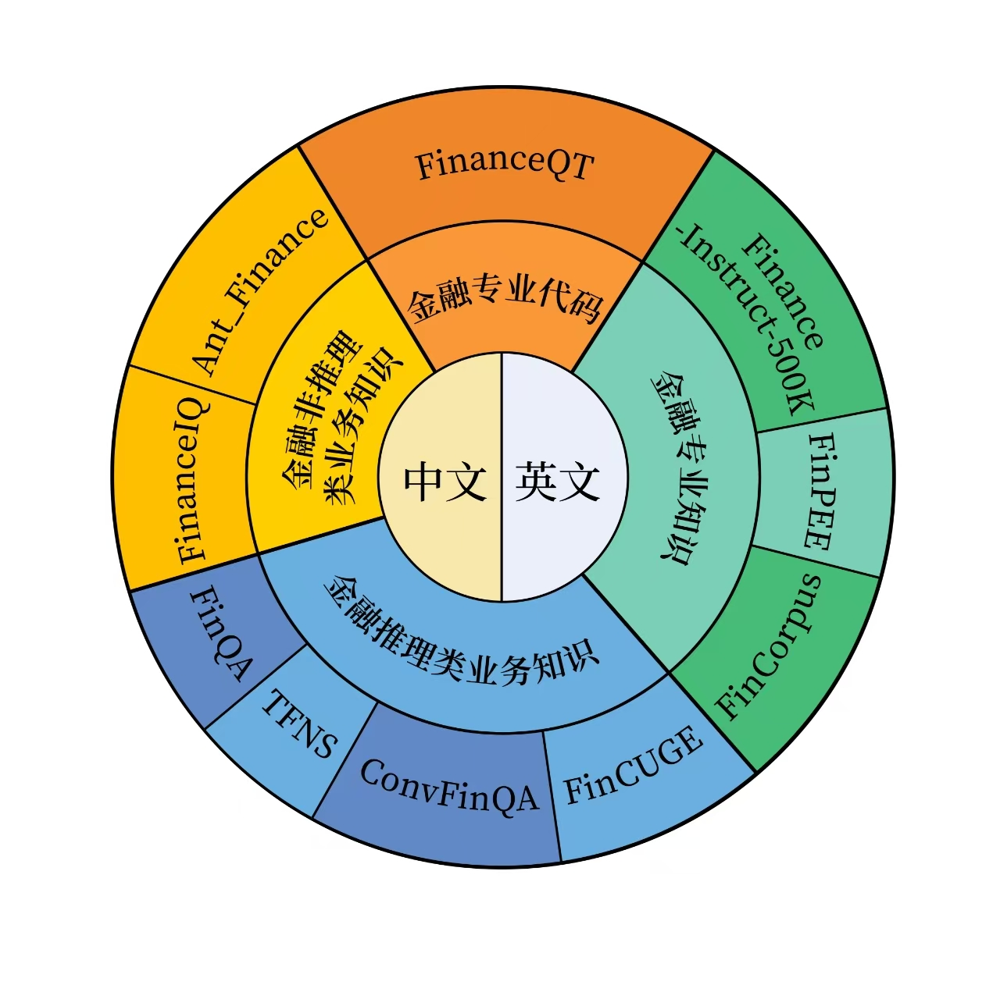

# SuFin-R1金融推理大模型：以创新技术重塑金融决策智能

## 目录 <a name="toc"></a>

1. [数据处理](#data)
2. [训练流程](#trainning)
3. [评估使用](#usage)
7. [评估结果](#results)

## 🛠️ 数据处理 <a name="data"></a>
为将 DeepSeek R1 的能力迁移至金融场景，我们构建了 Financial - R1 - Distill - Data 数据集。此数据集是面向专业金融场景开发的高质量指令微调数据集，由 Deepseek - R1（完整版）提炼而成，属于 SFT 数据集。其总规模约 30k 条，中英混合，涵盖金融垂直领域多维度专业知识。数据源包括 Ant_Finance、FinanceIQ、FinanceQT、ConvFinQA、TFNS、Finance - Instruct - 500k、FinPEE、FinCorpus、FinCUGE 这九大数据集。

#### 数据蒸馏

在蒸馏过程中，依照 DeepSeek - R1 官方提供的细节，进行如下设置的数据蒸馏操作：
1)	不增加额外的系统提示词
2)	设置temperature为0.6
3)	对于金融数学推理型数据，增加提示词，“请一步步推理，并把最终答案放到 \\boxed{}。”
4)	防止跳出思维模式，强制在每个输出的开头增加"\n"，再开始生成数据

为方便大家使用，在发布的 SFT 数据中，增加了数据集的来源 repo_name 以及训练格式的 conversation 字段，便于数据溯源与模型训练。

#### 数据筛选

对数据生成结果进行了二次筛选：

1）答案打分：对于蒸馏得到的数据，针对客观题（如选择题、判断题），采用基于规则的匹配方式，校对蒸馏数据的正确性；对于无法通过规则匹配的结果，利用 Qwen2.5-72B-Instruct 模型对模型生成的答案以及正确答案进行打分，正确得 1 分，错误得 0 分。

2）推理过程打分：对于经过上一步筛选得到的正确思维链数据，再次利用 Qwen2.5-72B-Instruct 模型对推理轨迹进行打分，高质量数据得 1 分，低质量数据得 0 分。我们采取了如下几个指标来进行打分：
- 内部一致性
- 术语重叠率
- 逻辑一致性
- 推理步骤数量
- 内容的多样性
- 任务领域相关性

经过两轮筛选得到的数据，将作为高质量的 COT 数据；未经过筛选的数据则用于强化学习（RL）。

Financial-R1-Distill-Data 根据具体任务内容，整理为以下四大模块：

- 金融代码
- 金融专业知识
- 金融非推理类业务知识
- 金融推理类业务知识

#### 数据分布如下：


|数据集|数据量|
|-------------|--------|
|Convfinqa published|3814|
|Finance instruct published | 5650 |
|FinCUGE Instruction published | 2,000 |
|FinQA published | 1,474 |
|TFNS published | 1,225|
|FinanceIQ published | 1,038 |
|Quant Trading Instruct published | 60 |
|Ant Finance published | 619 |
|FinCorpus published | 14,636|
|FinPEE published | 179 |
|总计| 30695 |


## 🚀  训练流程 <a name="trainning"></a>

### 总体工作流程



---

### 🛠️  训练流程

#### 第一阶段：监督式微调（SFT）

我们将使用 LLaMA-Factory 框架进行训练。具体来说，我们以 Qwen2.5-7B 模型为基础模型，并使用金融推理数据集（包括 ConvFinqa 和 FinQA）进行监督式微调（SFT）。最终输出为 Qwen2.5-7B-SFT 模型。

**安装步骤:**

```bash
git clone --depth 1 [LLaMA-Factory](https://github.com/hiyouga/LLaMA-Factory.git)
cd LLaMA-Factory
pip install -e ".[torch,metrics]"
```

**添加新数据集:**

- Place the dataset JSON files in the following directory:
  ```
  ./LLaMA-Factory/data
  ```
- Update the dataset index in the following JSON file:
  ```
  ./LLaMA-Factory/data/dataset_info.json
  ```

**运行训练:**

```bash
CUDA_VISIBLE_DEVICES=0,1,2,3,4,5,6,7 GRADIO_SHARE=1 GRADIO_SERVER_PORT=2333 llamafactory-cli webui
```

更多详细操作请参考 原始框架文档。

---

#### 第二阶段：强化学习（RL）

我们将使用 OpenR1 框架进行这一阶段的训练。具体来说，我们以 Qwen2.5-7B-SFT 模型为基础，通过 Group Relative Policy Optimization（GRPO）进行强化学习训练，使用金融推理数据集（ConvFinqa 和 FinQA）进行强化学习（RL）。最终输出为 Fin-R1-7B 模型。

**安装步骤:**

```bash
uv venv openr1 --python 3.11 && source openr1/bin/activate && uv pip install --upgrade pip
uv pip install vllm==0.7.2
uv pip install setuptools && uv pip install flash-attn --no-build-isolation
GIT_LFS_SKIP_SMUDGE=1 uv pip install -e ".[dev]"
```

**添加数据集和模型:**

- 修改配置文件中的数据集和模型路径:
  ```
  recipes/Qwen2.5-7B-Instruct/grpo/config_demo.yaml
  ```

**启动训练:**

```bash
accelerate launch \
    --config_file recipes/accelerate_configs/zero3.yaml \
    --num_processes 3 \
    --main_process_port 29501 \
    src/open_r1/grpo.py \
    --config recipes/Qwen2.5-7B-Instruct/grpo/config_demo.yaml
```

#### 安装和运行 Open WebUI 

##### **安装 Open WebUI**

1. **确保 Python 版本**  
   请确保使用 Python 3.11 以避免兼容性问题。

2. **安装命令**  
   打开终端并运行以下命令以安装 Open WebUI：
   
   ```bash
   pip install open-webui
   ```

##### **运行 Open WebUI**

1. **启动命令**  
   
   安装完成后，运行以下命令启动 Open WebUI：
   
   ```bash
   open-webui serve
   ```
   
2. **访问界面**  
   启动后，通过在浏览器中访问 `http://localhost:8080` 来使用 Open WebUI。

按照这些步骤，您可以快速安装并运行 Open WebUI，开始利用其强大的 AI 功能。

## 🧐 评估使用 <a name="usage"></a>
1.安装说明

  ●你需要下载 [evalscope_fin](). 先在evalscope_fin目录下运行以下命令:
```bash
git clone 
cd evalscope_fin
pip install -e .
```
2.参考框架

  本文件是基于evalscope的框架修改的，因此使用方法可以参考官方使用手册 [evalscope_fin](https://evalscope.readthedocs.io/zh-cn/latest/index.html). 本文件修改的内容主要有：

  ●添加了我们的数据集，位于：evalscope/benchmark/（fineval、FinQA等）

  ●添加了llm as judger的方式，具体实现位于上面新增数据集路径下面每个数据集对应的adapter.py文件中，可以修改对应的prompt，注意，该方式需要在evalscope\benchmarks\llm_as_judge.yaml文件中填写api，用于llm辅助评测结果，此处目前默认使用gpt-4o作为打分模型。如果不想使用llm as judger，可以参考fineval客观题是如何评分的。

  ●调用api的方式改成了request和openai两种方式，根据情况选择（原代码只支持openai方式）. 

3.使用说明

  ●直接运行run_example1.py（api调用）和run_example2.py（本地模型）。具体的参数配置在这两个文件里面有写。

  ●runfinr1.py是测试数据集的一个样例，可以参考使用如何测多个模型、多个数据集。

4. 添加数据集

  ●在evalscope/benchmark/路径下新建文件夹命名为对应数据集名称，里面应包含数据和一个adapter.py文件，选择题可以直接参考fineval文件夹里的配置，采用正则化匹配答案。如果要使用llm as a judger的方式评分，可以参考fineval_definition、FinQA。

  ●注意，数据集的形式不需要统一，只需在adapter.py中对应读取函数中写清楚怎么读取数据


## 🧐 评估结果 <a name="results"></a>

#### 金融场景

| Model                            | FinQA   | ConvFinga | Ant_Finance | TFNS    | Finance-Instruct |
|---------------------------------|---------|-----------|-------------|---------|------------------|
| FinR1-7B                        | 0.761   | 0.84      | 0.81        | 0.718   | 0.629            |
| Qwen-2.5-7B-Instruct            | 0.60    | 0.66      | 0.85        | 0.68    | 0.49             |
| Qwen-2.5-32B-Instruct           | 0.72    | 0.78      | 0.84        | 0.77    | 0.58             |
| DeepSeek-R1                     | 0.71    | 0.82      | 0.90        | 0.78    |                  |
| DeepSeek-R1-Distil I-Qwen-32B   | 0.70    | 0.72      | 0.87        | 0.79    | 0.54             |
| DeepSeek-R1-Distil I-Qwen-7B    | 0.55    | 0.62      | 0.71        | 0.60    | 0.42             |
| DeepSeek-R1-Distil I-Qwen-14B   | 0.62    | 0.73      | 0.82        | 0.65    | 0.49             |

#### 数学能力评估

| 模型                     | MATH-500 (EM) | AIME 2024 (Pass@1) |
|--------------------------|---------------|--------------------|
| FinR1-7B                 | 76.4          | 20                 |
| GPT4o-0513               | 74.6          | 9.3                |
| LLama3.1-405B            | 73.8          | 23.3               |
| claude3.5-sonnet 1022    | 78.3          | 16                 |
| Step-2-16K             | 77.6          | 10                 |
| GLM-4-Plus             | 74.8          | 3.3                |

#### 中文能力

| 模型                     | CEval    |
|--------------------------|----------|
| FinR1-7B                 | 78.04    |
| GPT4o-0513               | 76       |
| LLama3.1-405B            | 61.5     |
| claude3.5-sonnet 1022    | 76.7     |
| XuanYuan2-70B          | 72.7     |

#### 英文指令跟随场景

| 模型                     | ifeval   |
|--------------------------|----------|
| o1-mini-2024-09-12     | 75.4     |
| FinR1-7B                 | 73.74    |
| Llama3.1-8B-Instruct   | 73.4     |
| Gemma-2-9B-it          | 72.5     |
| Qwen2.5-7B-Instruct    | 72.7     |
| GLM-4-9B-Chat          | 69.3     |
| Phi-4                  | 64       |
