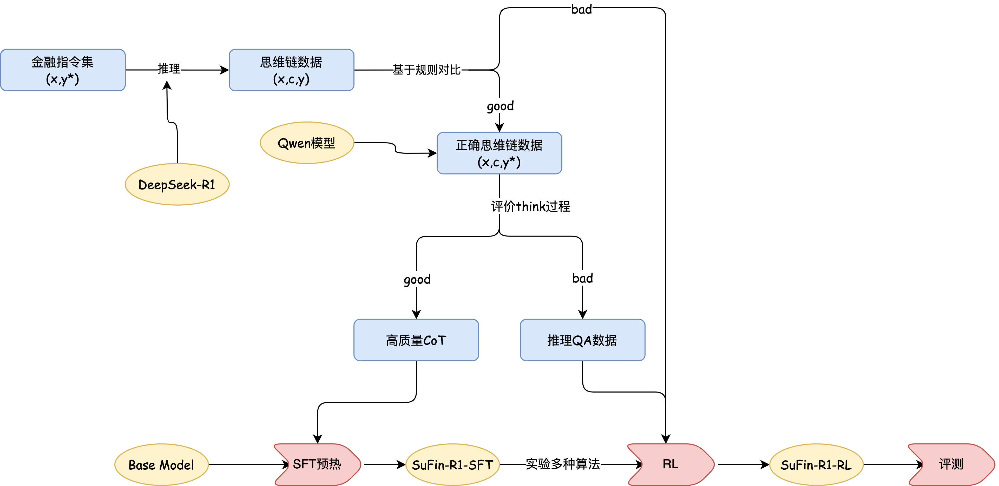
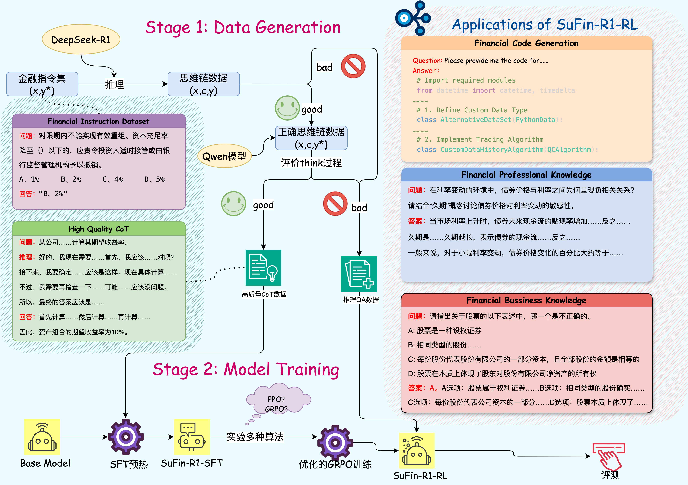

---
# SuFin-R1金融推理大模型：以创新技术重塑金融决策智能

SuFin-R1 是一款针对金融领域复杂推理的大型语言模型，由上海财经大学统计与数据科学学院人工智能金融大模型实验室开发并开源。该模型以 Qwen2.5-7B 为基座，通过高质量的可验证金融问题微调训练，最终表现在多个金融领域基准测试上的表现超过了满血版 DeepSeek-R1 。



## 目录<a name="toc"></a>
1. [概述](#data)
2. [金融推理数据](#data)
3. [模型微调训练](#trainning)
7. [模型评测系统](#result)
8. [模型评测结果](#results)
## 💡 概述
SuFin-R1 是一个金融领域的推理大语言模型，经过金融专业知识、金融非推理类业务知识、金融推理类业务知识以及金融代码四个模块数据微调训练得到。这些数据模块为模型在金融领域的应用中提供了坚实的理论支撑、业务规则、决策逻辑以及技术实现能力，以用于实现不同的功能：

###应用场景示例: 安全合规 信用评估 智能投顾 


## 🛠️ 数据处理<a name="data"></a>
为将 DeepSeek-R1 的能力迁移至金融场景，我们基于 Ant_Finance、FinanceIQ、FinanceQT、ConvFinQA、TFNS、Finance-Instruct-500k、FinPEE、FinCorpus、FinCUGE 这九大数据集构建了 Financial-R1-Distill-Data 数据集。该数据集由 Deepseek-R1（完整版）提炼而成，是面向专业金融推理场景开发的高质量指令微调数据集。其总规模约 30k 条，包含中英文两种语言，涵盖金融垂直领域多维度专业知识。

### 数据蒸馏

在蒸馏过程中，我们严格依照 [DeepSeek - R1](https://github.com/deepseek-ai/DeepSeek-R1) 官方提供的细节，进行相应设置的数据蒸馏操作：

### 数据筛选

对数据生成结果进行了两次筛选：

1）答案打分：对于蒸馏得到的数据，针对客观题（如选择题、判断题），采用基于规则的匹配方式，校对蒸馏数据的正确性；对于无法通过规则匹配的结果，利用 Qwen2.5-72B-Instruct 模型对模型生成的答案以及正确答案进行打分，正确得 1 分，错误得 0 分。
```
prompt_template = '''
        你是一位金融领域的专家评估员。请根据问题、正确答案以及待评分答案，对提供的答案进行打分。

    Question: {question}
    Correct Answer: {gold_answer}
    Answer to be Scored: {answer}

评分标准如下：
    1. 答案正确性（主要标准）：
       - 如果待评分答案与标准答案数值相同，得1分
       - 如果待评分答案与标准答案存在显著偏差，得0分
    2. 数学表达：
       - 允许使用不同的数学表达方式，只要表达等价即可
       - 例如：0.2和20%视为等价表达  
    3. 单位表示：
       - 允许使用不同的单位表示方式，如"亿元"和"亿"视为等价
       - 单位可以与标准答案不一致，只要换算后相等即可
    注意事项：
     - 待评分答案不一定与标准答案完全一致，只要表达了相同的数值结论即可
     - 如果答案正确但缺少解题步骤，仍可得分
     - 如果答案错误但解题步骤正确，不得分
    Response requirement: Only provide the result, and place the score at the end in \\boxed{{}}. Do not output the thought process.
    Output example: \\boxed{{1}} or \\boxed{{0}}
    '''
```
2）推理过程打分：对于经过上一步筛选得到的正确思维链数据，再次利用 Qwen2.5-72B-Instruct 模型对推理轨迹进行打分，高质量数据得 1 分，低质量数据得 0 分。我们采取了如下几个指标来进行打分：
```
prompt = f"""
    请根据以下标准评估推理过程的质量：
    1.内部一致性：检查推理过程中的步骤是否一致，并且是否能够逐步逻辑地推导出标准答案。
    2.术语重叠度：检查推理过程中使用的术语与标准答案中的术语的重叠程度。重叠度越高越好。
    3.推理步骤数量：评估推理过程是否包含足够的步骤（至少3步）。
    4.逻辑一致性：确保推理过程中的步骤与标准答案在逻辑上高度一致，并检查是否存在明显的错误或遗漏。
    5.内容多样性：检查推理过程中是否存在大量重复的步骤。
    6.与任务领域的相关性：检查推理过程是否涉及与任务领域相关的内容（任务领域：{task_domain}）。如果推理反映了与任务领域的相关性，则给予更高的评分。
    7.与任务指令的一致性：检查推理过程是否与任务指令高度相关。相关性越高越好。如果推理内容完全符合任务指令，则给予更高的评分。

    以下是问题、推理过程和标准答案：
    Question: {task_instruction}
    Reasoning Process: {reasoning}
    Standard Answer: {gold_answer}

    请根据以下标准给出评分：
    -如果推理过程质量高，评分为1。
    -如果推理过程质量差，评分为0。
    -评分只能是1或0。
    -请逐步思考，并将评分用\boxed{{}}格式包裹，以便通过正则表达式轻松提取。 
    """
```
我们将经过两轮筛选后得到的数据作为高质量的 COT 数据用于 SFT ；而未经过筛选的数据则用于强化学习（RL）。

### SuFin-R1-SFT数据分布如下：

|数据集|数据量|
|-------------|--------|
|Convfinqa published|3814|
|Finance instruct published | 5650 |
|FinCUGE Instruction published | 2,000 |
|FinQA published | 1,474 |
|TFNS published | 1,225|
|FinanceIQ published | 1,038 |
|Quant Trading Instruct published | 60 |
|Ant Finance published | 619 |
|FinCorpus published | 14,636|
|FinPEE published | 179 |
|总计| 30695 |

有关数据的具体任务内容和示例可在[Financial-R1-Distill-Data](https://github.com/SUFE-AIFLM-Lab/SuFin-R1/blob/main/Financial-R1-Distill-Data.md)查看

## 🚀 训练流程<a name="trainning"></a>

### 总体工作流程


### 训练流程

#### 第一阶段：监督式微调（SFT）

我们将使用 LLaMA-Factory 框架进行训练。具体来说，我们以 Qwen2.5-7B 模型为基础模型，并使用金融推理数据集（包括 ConvFinqa 和 FinQA）进行监督式微调（SFT）。最终输出为 Qwen2.5-7B-SFT 模型。

第一阶段----复杂推理学习——筑造金融智慧基石： 

团队基于Llama-Factory框架进行微调，对通用基座模型Qwen2.5-7B进行了深度领域适配，注入大量高质量金融推理类COT数据，显著提升模型对金融术语、金融逻辑推理和风险预测的理解能力。 

第二阶段----强化学习优化——磨砺金融推理利刃： 

在掌握复杂推理技能后，使用 Open-R1 框架进行强化学习训练，采用的 GRPO（Generalized Reward Policy Optimization）算法优化模型的专业性与合规性，我们在 GRPO 算法的基础上进行了 Reference model 的去除，优化模型的学习，且使用格式奖励和准确率奖励进行强化学习训练，最终得到了在金融推理任务上有着明显提升的 SuFin-R1-7B 模型。


## 🧐 模型评测系统 <a name="result"></a>

我们基于 evalscope 框架进行评测，详细使用方法可以参考官方使用手册 [evalscope](https://github.com/modelscope/evalscope)。我们修改的内容主要有：

1.在 evalscope/benchmark/ 中添加了我们的评测数据集，数据集的形式不需要统一，只需在[adapter.py](https://github.com/SUFE-AIFLM-Lab/SuFin-R1/blob/main/adapter.py)中写清楚读取数据规则即可。

2.添加了 llm as judger 的方式，我们目前使用 gpt-4o 作为打分模型。若不想使用 llm as judger ，可以使用客观题的正则化匹配答案评分方式。
```
    # llm as judge
    eval_model: gpt-4o
    eval_api_url: "api_url"
    eval_api_key: "your api_key"
```

3.修改调用api的方式，可根据情况选择request和openai两种方式（原代码只支持openai方式）。

4. 使用 api 调用方式进行评测：
```
from evalscope import TaskConfig, run_task
from evalscope.constants import EvalType

task_cfg = TaskConfig(
    model='',   # 模型名称 (需要与部署时的模型名称一致)
    api_url='',  # 推理服务地址
    api_key='your api_key',
    api_type='request',
    eval_type='service',   # 评测类型，SERVICE表示评测推理服务
    datasets=[
    # 'math_500',  # 数据集名称
     'fineval_definition'   
    ],
    dataset_args={ # EvalScope内置支持，无需指定数据集ID
    'fineval_definition': {'subset_list': ['main'], 'few_shot_num': 0},
    },    
    limit=5,
    eval_batch_size=5,
    generation_config={       # 模型推理配置
        'max_tokens': 4096,  # 最大生成token数，建议设置为较大值避免输出截断
        'temperature': 0.6,   # 采样温度 (deepseek 报告推荐值)
        'top_p': 0.95,        # top-p采样 (deepseek 报告推荐值)
        'n': 1                # 每个请求产生的回复数量 (注意 lmdeploy 目前只支持 n=1)
    },
    stream=False               # 是否使用流式请求，推荐设置为True防止请求超时
)

run_task(task_cfg=task_cfg)
```
使用本地部署模型方式进行评测：
```
from evalscope import TaskConfig, run_task
from evalscope.constants import EvalType

#先运行这个命令起一个vllm推理服务，可以根据需要修改参数
#CUDA_VISIBLE_DEVICES=0,1 export VLLM_USE_MODELSCOPE=True && python -m vllm.entrypoints.openai.api_server --model #模型路径 --served-model-name #模型名称 --trust_remote_code --port 8801 --tensor-parallel-size 2

task_cfg = TaskConfig(
    model='',   # 模型名称 (需要与部署时的模型名称一致)
    api_url='',  # 推理服务地址，8801是与上面对应的
    eval_type='service',   # 评测类型，SERVICE表示评测推理服务
    datasets=[
    # 'math_500',  # 数据集名称
    'fineval', 'fineval_definition'   
    ],
    dataset_args={ 
    'fineval_definition': {'subset_list': ['main'], 'few_shot_num': 0},
    },    
    limit=5,
    eval_batch_size=1,
    generation_config={       # 模型推理配置
        'max_tokens': 4096,  # 最大生成token数，建议设置为较大值避免输出截断
        'temperature': 0.6,   # 采样温度 (deepseek 报告推荐值)
        'top_p': 0.95,        # top-p采样 (deepseek 报告推荐值)
        'n': 1                # 每个请求产生的回复数量 (注意 lmdeploy 目前只支持 n=1)
    },
    stream=False               # 是否使用流式请求，推荐设置为True防止请求超时
)

run_task(task_cfg=task_cfg)
```
同时使用多个模型在多个基准测试上进行评测：
```
from evalscope import TaskConfig, run_task
from evalscope.constants import EvalType

model_list = ['qwen2.5-32b-instruct','qwen2.5-14b-instruct','qwen2.5-7b-instruct']

for model in model_list:
    task_cfg = TaskConfig(
        model=model,   # 模型名称 (需要与部署时的模型名称一致)
        api_url='',  # 推理服务地址
        api_key='your api_key',
        eval_type='service',   # 评测类型，SERVICE表示评测推理服务
        api_type='request',
        #数据集配置
        datasets=[
            'Ant_Finance',
            'Finance_instruct',
            'FinanceIQ',
            'FinanceQT',
            'FinCorpus',
        ],  
        limit=1, #每个数据集测试的数量
        eval_batch_size=20,   # 测评batch size
        review_batch_size=10, # llm as judge batch size
        
        generation_config={       # 模型推理配置
            'max_tokens': 4096,  # 最大生成token数，建议设置为较大值避免输出截断
            'temperature': 0.6,   # 采样温度 (deepseek 报告推荐值)
            'top_p': 0.95,        # top-p采样 (deepseek 报告推荐值)
            'n': 1                # 每个请求产生的回复数量 (注意 lmdeploy 目前只支持 n=1)
        },
        stream=True               # 是否使用流式请求，推荐设置为True防止请求超时
)

    run_task(task_cfg=task_cfg)
```

## 🚨 模型评测结果 <a name="results"></a>
本模型在金融数值推理、数学逻辑推演和中英双语交互三大核心维度均展现行业领先水平
### 金融场景
我们在以下金融场景的基准测试上对模型进行评估，这些基准测试聚焦真实世界中金融表格数据驱动的数值推理任务以及多轮交互场景。模型在 FinQA 和 ConvFinQA 两大金融问答基准上，性能表现超越了满血版 DeepSeek-R1 ，展现出模型对上下文连贯性与数值推理一致性的强大处理能力。
| Model                            | FinQA   | ConvFinga | Ant_Finance | TFNS    | Finance-Instruct |
|---------------------------------|---------|-----------|-------------|---------|------------------|
| FinR1-7B                        | 0.761   | 0.84      | 0.81        | 0.718   | 0.629            |
| Qwen-2.5-7B-Instruct            | 0.60    | 0.66      | 0.85        | 0.68    | 0.49             |
| Qwen-2.5-32B-Instruct           | 0.72    | 0.78      | 0.84        | 0.77    | 0.58             |
| DeepSeek-R1                     | 0.71    | 0.82      | 0.90        | 0.78    | 0.70             |
| DeepSeek-R1-Distil I-Qwen-32B   | 0.70    | 0.72      | 0.87        | 0.79    | 0.54             |
| DeepSeek-R1-Distil I-Qwen-7B    | 0.55    | 0.62      | 0.71        | 0.60    | 0.42             |
| DeepSeek-R1-Distil I-Qwen-14B   | 0.62    | 0.73      | 0.82        | 0.65    | 0.49             |

### 数学能力评估
我们的实验发现虽然没有特意提升模型的数学能力，但是经过金融推理训练后的模型在数学场景中也表现出一定性能的提升。
| 模型                     | MATH-500 (EM) | AIME 2024 (Pass@1) |
|--------------------------|---------------|--------------------|
| FinR1-7B                 | 76.4          | 20                 |
| GPT4o-0513               | 74.6          | 9.3                |
| LLama3.1-405B            | 73.8          | 23.3               |
| claude3.5-sonnet 1022    | 78.3          | 16                 |
| Step-2-16K             | 77.6          | 10                 |
| GLM-4-Plus             | 74.8          | 3.3                |

中文场景专精化：SuFin-R1 在 CEval 上以 78.04 的突破性表现超越 GPT-4o ，彰显本土化优势，配合 73.74 的英文指令跟随能力（ifeval），构建起横跨中英的金融服务智能体基础。

### 中文能力

| 模型                     | CEval    |
|--------------------------|----------|
| FinR1-7B                 | 78.04    |
| GPT4o-0513               | 76       |
| LLama3.1-405B            | 61.5     |
| claude3.5-sonnet 1022    | 76.7     |
| XuanYuan2-70B          | 72.7     |

### 英文指令跟随场景

| 模型                     | ifeval   |
|--------------------------|----------|
| o1-mini-2024-09-12     | 75.4     |
| FinR1-7B                 | 73.74    |
| Llama3.1-8B-Instruct   | 73.4     |
| Gemma-2-9B-it          | 72.5     |
| Qwen2.5-7B-Instruct    | 72.7     |
| GLM-4-9B-Chat          | 69.3     |
| Phi-4                  | 64       |
