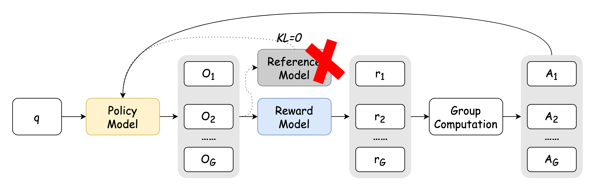

---
[](https://huggingface.co/SUFE-AIFLM-Lab/Fin-R1)            
[](https://huggingface.co/datasets/SUFE-AIFLM-Lab/Fin-R1-Data)          
[](#)    
# Fin-R1 Financial Reasoning Large Model: Reshaping Financial Decision Intelligence with Innovative Technology  

Fin-R1 is a large language model designed for complex reasoning in the financial domain, developed and open-sourced by the Artificial Intelligence Financial Large Model Laboratory (SUFE-AIFLM-Lab) at the School of Statistics and Data Science, Shanghai University of Finance and Economics. Built on the Qwen2.5-7B-Instruct base model, Fin-R1 is fine-tuned with high-quality verifiable financial questions and achieves state-of-the-art (SOTA) performance on multiple financial benchmark tests.  


## Table of Contents<a name="toc"></a>
1. [Overview](#summary)
2. [Data Construction](#data)
3. [Fine-Tuning and Training](#trainning)
7. [Evaluation and Usage Instructions](#use1)
8. [Model Evaluation Results](#results)
9. [Model Usage Instructions](#use)
10. [Statement and Future Outlook](#todo)
11. [Contact Us](#connection)
## 💡  Overview<a name="summary"></a>
Fin-R1 is a financial reasoning large language model developed and open-sourced by the Artificial Intelligence Financial Large Model Laboratory (SUFE-AIFLM-Lab) at the School of Statistics and Data Science, Shanghai University of Finance and Economics. With a lightweight design of 7 billion parameters, Fin-R1 significantly reduces deployment costs while providing robust theoretical support, business rules, decision logic, and technical implementation capabilities for financial applications through a high-quality correct reasoning chain data and a two-stage training framework of SFT (Supervised Fine-Tuning) and RL (Reinforcement Learning). The model enhances complex financial reasoning capabilities for various functions:    

### +数据-场景总览图

### Application Scenarios 
#### Security and Compliance

#### Intelligent Risk Control

#### Intelligent Investment Advisory

#### ESG Analysis

#### English Finance

#### Financial Calculation

#### Financial Code


### Overall Workflow


## 🛠️ Data Construction<a name="data"></a>
To migrate the reasoning capabilities of DeepSeek-R1 to the financial domain and address the issue of high-quality financial reasoning data, we used DeepSeek-R1 (full version) to distill domain knowledge from multiple datasets covering industry corpora (FinCorpus, Ant_Finance), professional cognition (FinPEE), business knowledge (FinCUGE, FinanceIQ, Finance-Instruct-500K), table parsing (FinQA), market insights (TFNS), multi-turn interactions (ConvFinQA), and quantitative investment (FinanceQT). We constructed a high-quality Chain-of-Thought (COT) dataset of approximately 60,000 entries, named Fin-R1-Data, tailored for professional financial reasoning scenarios. This dataset encompasses multi-dimensional professional knowledge in both Chinese and English financial vertical domains and is divided into four major modules according to specific task content: financial code, financial professional knowledge, non-reasoning financial business knowledge, and reasoning-related financial business knowledge. It effectively supports core financial scenarios in banking, funds, and securities.

### +数据处理图

### 数据蒸馏

During the distillation process, we strictly followed the details provided by [DeepSeek - R1](https://github.com/deepseek-ai/DeepSeek-R1) and conducted corresponding data distillation operations.

### Data Filtering

We performed two stages of data filtering. In the first stage, we filtered data by accepting only solutions that matched the standard answers. In the second stage, we filtered the model's reasoning trajectory data. Each filtering round labeled the data as either "good" or "bad":

1）Answer Scoring: For the distilled data, objective questions (such as multiple-choice and true/false questions) were verified using rule-based matching to check the correctness of the distilled data. For results that could not be matched by rules, we used the Qwen2.5-72B-Instruct model to score the model-generated answers against the correct answers, with correct answers scoring 1 point and incorrect answers scoring 0 points.

2）Reasoning Process Scoring: For the correctly filtered reasoning chain data, we again used the Qwen2.5-72B-Instruct model to score the reasoning trajectories. High-quality data scored 1 point, while low-quality data scored 0 points. We evaluated based on the following criteria:
>
> 1.Internal Consistency: Checking whether the steps in the reasoning process are consistent and can logically derive the standard answer step-by-step.
>
> 2.Term Overlap: Assessing the overlap of terms used in the reasoning process with those in the standard answer. Higher overlap is preferred.
>
> 3.Number of Reasoning Steps: Evaluating whether the reasoning process contains a sufficient number of steps (at least three steps).
>
> 4.Logical Consistency: Ensuring the steps in the reasoning process are highly consistent with the standard answer in logic, and checking for any obvious errors or omissions.
>
> 5.Content Diversity: Checking for repetitive steps in the reasoning process.
>
> 6.Relevance to Task Domain: Assessing whether the reasoning process involves content relevant to the task domain (task domain: {task_domain}). Higher scores are given if the reasoning reflects relevance to the task domain.
>
> 7.Consistency with Task Instructions: Checking whether the reasoning process is highly relevant to the task instructions. Higher relevance is preferred, and higher scores are given if the reasoning fully complies with the task instructions.

Data labeled as "good" after both rounds of filtering were used as high-quality COT data for SFT, while data labeled as "bad" were used as reasoning QA data for Reinforcement Learning (RL).

### Distribution of Fin-R1-Data:

|Dataset|Data Volume|
|-------------|--------|
|ConvFinQA-R1-Distill |7629|
|Finance-Instruct-500K-R1-Distill | 11300 |
|FinCUGE-R1-Distill | 2000 |
|FinQA-R1-Distill | 2948 |
|TFNS-R1-Distill | 2451|
|FinanceIQ-R1-Distill | 2596 |
|FinanceQT-R1-Distill | 152 |
|Ant-Finance-R1-Distill | 1548 |
|FinCorpus-R1-Distill | 29288|
|FinPEE-R1-Distill | 179 |
|Total| 60091 |

For specific task content and examples of the data, please refer to[Fin-R1-Data](https://github.com/SUFE-AIFLM-Lab/SuFin-R1/blob/main/Fin-R1-Data.md)


## 🚀 Fine-Tuning and Training<a name="trainning"></a>

### Two-Stage Process
To optimize Qwen-7B-instruct for complex financial reasoning tasks, we employed a two-stage training framework to develop the financial reasoning large language model Fin-R1. Combining supervised fine-tuning (SFT) with high-quality financial reasoning data and reinforcement learning (RL) using the GRPO (Generalized Reward Policy Optimization) algorithm, Fin-R1 achieves high precision and strong generalization capabilities in financial reasoning tasks.
#### Stage One - Domain Knowledge Injection: 

Addressing issues such as logical disconnection and insufficient scene generalization in financial terminology understanding and compliance judgment for general models, our team conducted in-depth domain adaptation on the general base model Qwen2.5-7B using the Llama-Factory framework. By injecting a large amount of high-quality financial reasoning COT data, we significantly enhanced the model's understanding of financial terminology, financial logic reasoning, and risk prediction capabilities. 

#### Stage Two - Reinforcement Learning Optimization: 

After the model acquired complex reasoning skills, we used the Open-R1 framework for reinforcement learning training. After comparing various reinforcement learning algorithms, we selected the GRPO algorithm to optimize the model's output professionalism and compliance with a dynamic reward mechanism. We innovatively removed the traditional Reference model and adopted a dual-motivation mechanism of format rewards and accuracy rewards to optimize the model's learning.




## 🧐 Evaluation and Usage Instructions <a name="use1"></a>

Based on [evalscope](https://github.com/modelscope/evalscope)we constructed a benchmark testing framework tailored for multi-task characteristics in the financial domain and systematically validated it using five representative open-source heterogeneous datasets. Our main contributions include:
>
> 1.When adding our evaluation datasets, there is no need to unify the dataset format. Instead, simply specify the data reading rules in[adapter.py](https://github.com/SUFE-AIFLM-Lab/SuFin-R1/blob/main/adapter.py).
>
> 2.We introduced the LLM as Judger approach, currently using GPT-4o as the scoring model. If you prefer not to use LLM as Judger, you can opt for the regular expression matching method for objective questions.
>
> 3.We modified the API calling methods, allowing users to choose between request and openai methods (the original code only supported the openai method).


During evaluation, to address the heterogeneity of sample sizes in the evaluation datasets, we designed a dynamic threshold strategy: when the sample size of an evaluation dataset is below 1,000, we conduct full-scale testing to ensure statistical significance; when the sample size exceeds 1,000, we employ stratified sampling to randomly select 1,000 representative samples from each category to form a streamlined evaluation set.


## 🚨 Model Evaluation Results <a name="results"></a>
In authoritative evaluations covering finance, mathematics, and language capabilities, Fin-R1, with only 7 billion parameters, demonstrates remarkable performance, significantly surpassing other general LLMs. Particularly in financial scenarios, Fin-R1-7B outperforms the full-version DeepSeek-R1 on both FinQA and ConvFinQA.

### Financial Scenarios
We evaluated the model on several benchmark tests covering multiple financial business scenarios. The model comprehensively outperformed other models of the same scale and approached the performance of 32B models, ranking second with an average score of 75. It achieved the highest scores among the evaluated models on FinQA and ConvFinQA.
| Model                        | Parameters | FinQA | ConvFinga | Ant_Finance | TFNS |  Finance-Instruct-500k  | Average |
|------------------------------|------------|-------|-----------|-------------|------|-------------------------|---------|
| DeepSeek-R1                  | unknown    | 71.0  | 82.0      | 90.0        | 78.0 | 70.0                    | 78.2    |
| Qwen-2.5-Instruct            | 32B        | 72.0  | 78.0      | 84.0        | 77.0 | 58.0                    | 73.8    |
| DeepSeek-R1-Distill-Qwen     | 32B        | 70.0  | 72.0      | 87.0        | 79.0 | 54.0                    | 72.4    |
| Qwen2.5-SFT                  | 7B         | 73.0  | 81.0      | 76.0        | 68.0 | 61.0                    | 71.9    |
| Qwen-2.5-Instruct            | 14B        | 68.0  | 77.0      | 84.0        | 72.0 | 56.0                    | 71.4    |
| DeepSeek-R1-Distill-Qwen     | 14B        | 62.0  | 73.0      | 82.0        | 65.0 | 49.0                    | 66.2    |
| Qwen-2.5-Instruct            | 7B         | 60.0  | 66.0      | 85.0        | 68.0 | 49.0                    | 65.6    |
| DeepSeek-R1-Distill-Qwen     | 7B         | 55.0  | 62.0      | 71.0        | 60.0 | 42.0                    | 58.0    |
| Fin-R1                       | 7B         | 76.0  | 85.0      | 81.0        | 71.0 | 62.9                    | 75.2    |


## 🕵️ Model Usage Instructions <a name="use"></a>
You can directly download our model weights from Hugging Face:
```
git clone https://huggingface.co/SUFE-AIFLM-Lab/Fin-R1
```
Prepare the dependency environment and install vllm with the following command:
```
pip install vllm
```
Start the model service with a single command:
```
vllm serve "/path/Fin-R1" --port 8000 --gpu-memory-utilization 0.9 --max-model-len 16384 --tensor-parallel-size 2 --served-model-name "Fin-R1"
```


## 📌 Statement and Future Outlook <a name="todo"></a>
As a financial reasoning large language model, Fin-R1 can efficiently complete numerous financial tasks and provide professional services to users. However, it still faces technical bottlenecks and application limitations at this stage. The suggestions and analysis results it provides are for reference only and should not be equated with the precise judgments of professional financial analysts or experts. We sincerely hope that users will critically examine the model's output and make decisions in combination with their own professional knowledge and experience. Looking to the future, we will continue to optimize Fin-R1 and deeply explore its potential applications in cutting-edge financial scenarios to help the financial industry reach new heights of intelligence and compliance, injecting strong momentum into industry development.

## 📫 Contact Us <a name="connection"></a>
We sincerely invite industry peers to jointly explore the innovative paradigm of the deep integration of AI and finance and build a new ecosystem for intelligent finance.
