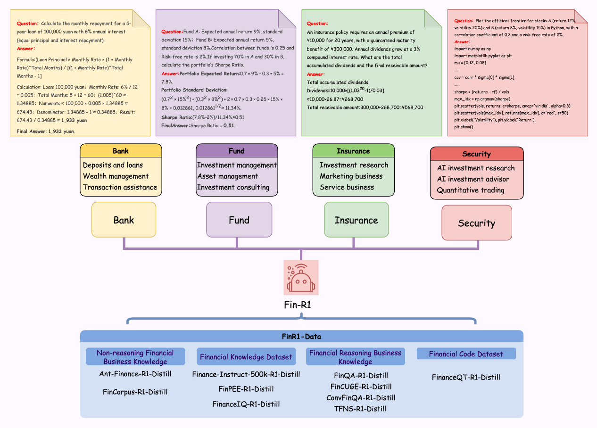
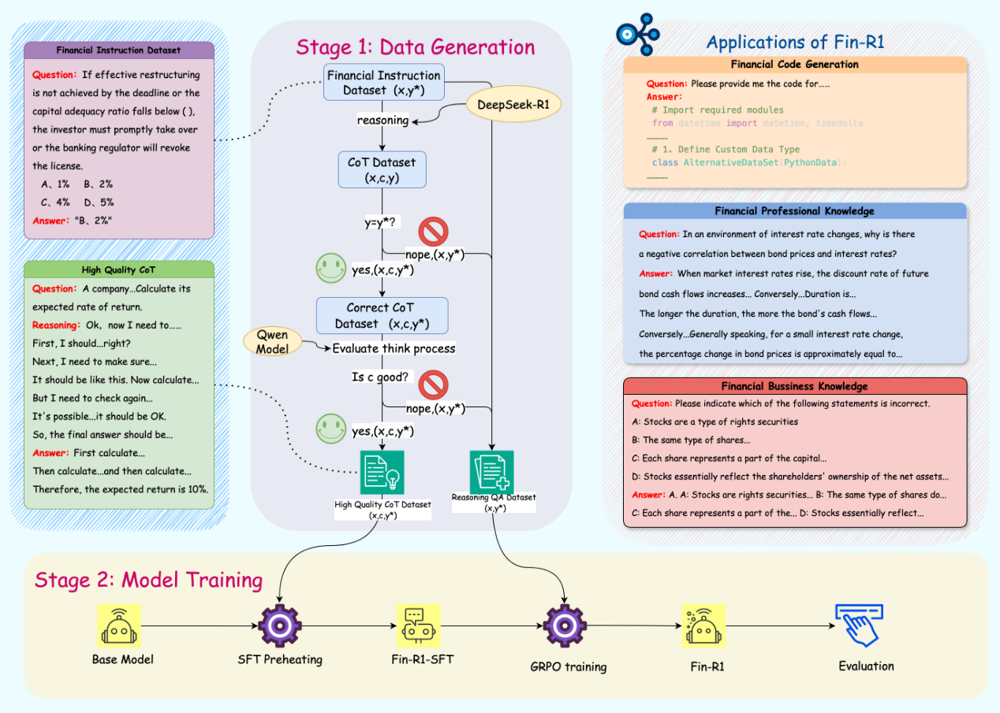
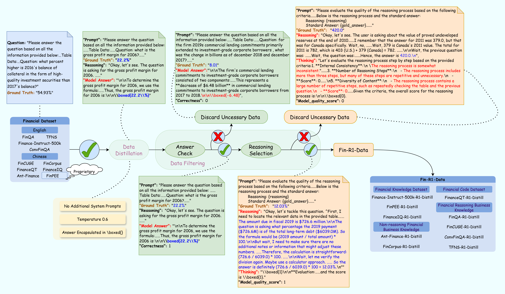
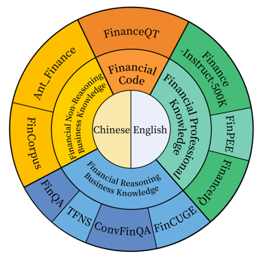
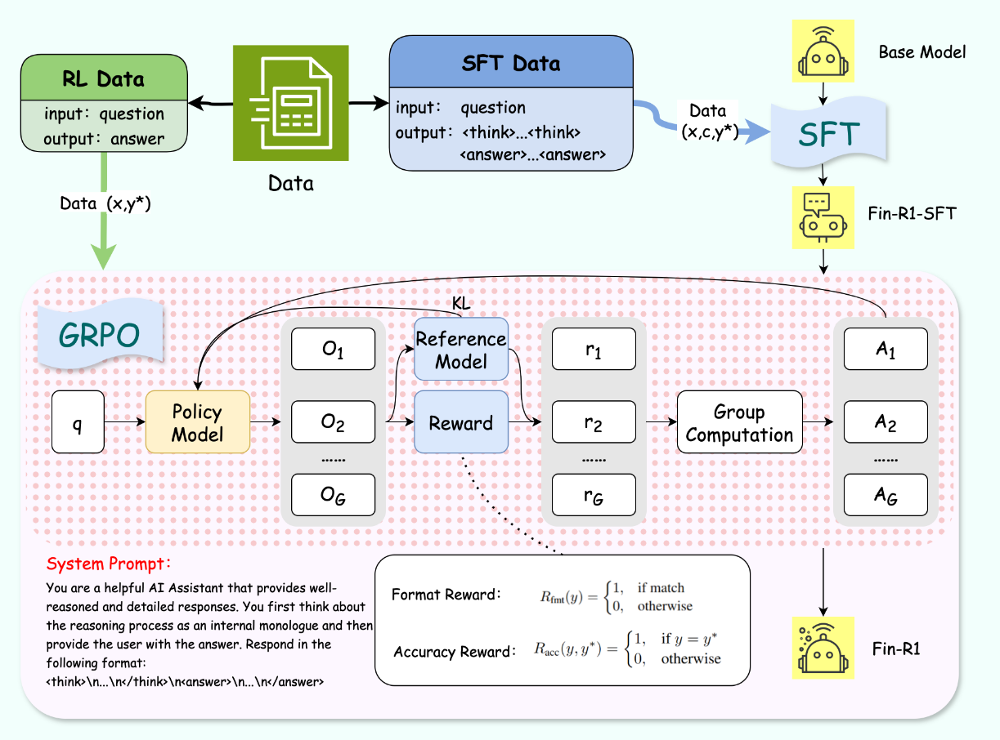

<div align="center">
  
</div>
<div align="center">
  <h1>Fin-R1: 強化学習による金融推論のための大規模言語モデル</h1>      
<!-- 徽章部分 -->
  
  [](https://www.apache.org/licenses/LICENSE-2.0) [](https://huggingface.co/SUFE-AIFLM-Lab/Fin-R1) [](https://arxiv.org/abs/2503.16252)               

  <!-- 语言切换链接 -->
  📄 [中文](./README.md) | [EN](./README_en.md) | [日本語](./README_ja.md)
</div>

Fin-R1は、上海財経大学統計データサイエンス学院のSUFE-AIFLM-LabとFinStep.AIの共同努力により開発およびオープンソース化された、複雑な金融推論のための大規模言語モデルです。Qwen2.5-7B-Instructを基に構築され、高品質な検証可能な金融質問で微調整することで、複数の金融ベンチマークでSOTAのパフォーマンスを達成しています。                        


## 📌 目次<a name="toc"></a>           
- [シナリオアプリケーション](#summary)      
  - [金融コード](#eg1)    
  - [金融計算](#eg2)    
  - [英語金融計算](#eg3)        
  - [金融セキュリティとコンプライアンス](#eg4)    
  - [インテリジェントリスク管理](#eg5)      
  - [ESG分析](#eg6)
- [全体のワークフロー](#Workflow)              
  - [データ構築](#data)            
  - [微調整とトレーニング](#trainning)
  - [モデル評価結果](#results)        
  - [モデル使用方法](#use)
- [将来の展望](#todo)
- [お問い合わせ](#connection)

  

## 💡 モデルアプリケーション <a name="summary"></a>  
Fin-R1は、金融推論の分野に特化した大規模言語モデルで、軽量な7Bパラメータアーキテクチャを特徴としています。展開コストを大幅に削減しながら、金融推論シナリオに特化した高品質な思考連鎖データでのSFT（監督微調整）とRL（強化学習）の2段階のトレーニングを経て、金融アプリケーションの理論的支援、ビジネスルール、意思決定ロジック、および技術実装の基盤を提供し、複雑な金融推論を実行する能力を効果的に向上させます。その結果、Fin-R1は銀行、証券、保険、信託のコア金融ビジネスシナリオに強力なサポートを提供します。              


 
## 金融コード <a name="eg1"></a>          
__金融コードは、金融分野で使用されるコンピュータプログラミングコードで、さまざまな金融モデル、アルゴリズム、および分析タスクに使用され、単純な金融計算から複雑なデリバティブの価格設定、リスク評価、およびポートフォリオの最適化までをカバーします。__  
          

## 金融計算 <a name="eg2"></a>
__金融計算は、さまざまな金融問題の定量分析と計算を行うプロセスであり、数学モデルと数値方法を使用して実際の金融問題を解決し、金融意思決定の科学的基盤を提供します。__          
    

## 英語金融計算 <a name="eg3"></a>          
__英語金融計算は、クロスランゲージ環境で金融モデルを構築し、計算を行い、国際的な同業者と英語でコミュニケーションを取ることを強調します。__      
                

## 金融セキュリティとコンプライアンス <a name="eg4"></a>            
__金融セキュリティとコンプライアンスは、金融犯罪の防止と規制遵守に焦点を当て、企業が堅牢なコンプライアンス管理システムを確立するのを支援します。__    
            

## インテリジェントリスク管理 <a name="eg5"></a>    
__インテリジェントリスク管理は、AIとビッグデータを使用して金融リスクを特定および管理し、従来の方法と比較して、より高い効率、精度、およびリアルタイム機能を提供します。__    
                  

## ESG分析 <a name="eg6"></a>
__ESG分析は、企業の環境、社会、およびガバナンスのパフォーマンスを評価し、その持続可能性を測定し、投資が財務的リターンを生み出しながら持続可能な発展を促進することを保証します。__    
    


## 全体のワークフロー  <a name="Workflow"></a>          
DeepSeek-R1に基づいて、データ蒸留フレームワークを構築し、公式のパラメータ設定に厳密に従ってデータ処理を行いました。2段階のデータスクリーニング方法を使用して金融データの品質を向上させ、SFTおよびRLデータセットを生成しました。トレーニング中に、Qwen2.5-7B-Instructを使用して、監督微調整（SFT）および強化学習（GRPO）を通じて金融推論モデルFin-R1を開発し、金融推論タスクの精度と一般化を向上させました。          
              

## 🛠️ データ構築 <a name="data"></a>
DeepSeek-R1の推論能力を金融シナリオに移行し、高品質な金融推論データのニーズに対応するために、Deepseek-R1（フルバージョン）を使用して、複数のデータセット（FinCorpus、Ant_Finance、FinPEE、FinCUGE、FinanceIQ、Finance-Instruct-500K、FinQA、TFNS、ConvFinQA、FinanceQT）を蒸留およびスクリーニングし、約60kの高品質なCOTデータセットFin-R1-Dataを生成しました。このデータセットは、中国語と英語の多次元金融知識をカバーし、さまざまな金融���アシナリオをサポートする4つのモジュールに分かれています。革新的にデュアルラウンドスコアリング方法を実装し、最初にルールマッチングとQwen2.5-72B-Instructを使用して回答の正確性を評価し、次に推論ロジックの一貫性と用語の適合性を評価しました。    



### データ蒸留

対応する設定のデータ蒸留の詳細については、[DeepSeek - R1](https://github.com/deepseek-ai/DeepSeek-R1)の公式提供の詳細に従いました。    

### データスクリーニング  

金融データの複雑さに対処するために、推論チェーンの「回答+推論」デュアルラウンドスコアリングおよびスクリーニング方法を採用しました。最初のラウンドでは、ルールベースのマッチングとQwen2.5-72B-Instructを使用して回答の正確性を評価しました。2番目のラウンドでは、推論ロジックの一貫性と用語の適合性を評価し、データの品質を確保しました。これらの評価に基づいて、データは「良い」または「悪い」とラベル付けされました。  

1）回答スコアリング：客観的な質問については、ルールベースのマッチングを使用して蒸留データの正確性を検証しました。検証できない結果については、Qwen2.5-72B-Instructを使用して、モデル生成の回答と正しい回答をスコアリングしました（正しい場合は1、不正解の場合は0）。    

2）推論プロセススコアリング：正しく回答されたデータについては、再度Qwen2.5-72B-Instructを使用して推論軌跡をスコアリングしました（高品質の場合は1、低品質の場合は0）。評価項目は以下の通りです：
>
> 1.内部一貫性：推論プロセスのステップが一貫しており、標準回答を段階的に論理的に導き出せるかどうかを確認します。
>
> 2.用語の重複度：推論プロセスで使用される用語と標準回答の用語の重複度を確認します。重複度が高いほど良いです。  
>
> 3.推論ステップの数：推論プロセスに十分なステップ数が含まれているかどうかを評価します（少なくとも3ステップ）。  
>
> 4.論理的一貫性：推論プロセスのステップが標準回答と高度に論理的一貫性があり、明らかなエラーや欠落がないかを確認します。
>
> 5.内容の多様性：推論プロセスに多くの繰り返しステップが含まれていないかを確認します。
>
> 6.タスクドメインとの関連性：推論プロセスがタスクドメインに関連する内容を含んでいるかどうかを確認します。関連性が高いほどスコアが高くなります。
>
> 7.タスク指示との一貫性：推論プロセスがタスク指示と高度に一致しているかどうかを確認します。一貫性が高いほど良く、タスク指示と完全に一致する場合はスコアが高くなります。

2ラウンドのフィルタリング後に「良い」とマークされたデータをSFTの高品質なCOTデータとして使用し、「悪い」とマークされたデータを強化学習（RL）の推論QAデータとして使用します。  

### Fin-R1-Dataデータ分布：
Fin-R1-Dataは、中国語と英語の多次元金融知識をカバーし、さまざまな金融コアシナリオをサポートする4つのモジュールに分かれています。    
           
|データセット|データ量|
|-------------|--------|
|ConvFinQA-R1-Distill |7629|
|Finance-Instruct-500K-R1-Distill | 11300 |  
|FinCUGE-R1-Distill | 2000 |
|FinQA-R1-Distill | 2948 | 
|TFNS-R1-Distill | 2451|                                                     
|FinanceIQ-R1-Distill | 2596 |
|FinanceQT-R1-Distill | 152 |
|Ant_Finance-R1-Distill | 1548 |
|FinCorpus-R1-Distill | 29288|
|FinPEE-R1-Distill | 179 |
|合計| 60091 |


  


## 🚀 微調整とトレーニング<a name="trainning"></a>

### 2段階プロセス             
金融分野の複雑な推論タスクに対して、Qwen2.5-7B-Instructの2段階の微調整を行い、金融推論の大規模言語モデルFin-R1を開発しました。まず、高品質な金融推論データを使用してSFT（監督微調整）を行い、モデルの初期の金融推論能力を向上させました。次に、GRPO（Group Relative Policy Optimization）アルゴリズムに基づいて、形式と正確性の報酬を組み込んだ強化学習を行い、金融推論タスクの精度と一般化をさらに向上させました。    
#### 第1段階 - 推論能力の注入：                                          
金融タスクの複雑な推論に対処するために、ConvFinQAおよびFinQAの金融データセットを使用してQwen2.5-7B-Instructの監督微調整を行いました。1回の微調整トレーニングの後、一般的なモデルの金融推論タスクでの誤った応答の問題を効果的に解決し、モデルが複雑な金融推論問題を深く理解し処理できるようにしました。                
#### 第2段階 - 強化学習の最適化：                               
モデルに複雑な推論スキルを装備した後、GRPOアルゴリズムをコアフレームワークとして採用し、形式と正確性のデュアル報酬メカニズムを通じて出力を最適化しました。さらに、モデルベースの検証器を導入し、Qwen2.5-Maxを使用して回答を評価し、正規表現ベースの報酬のバイアスを軽減しました。このアプローチにより、より正確で信頼性の高い報酬信号が生成され、強化学習の効果と安定性が向上しました。          



## 🚨 モデル評価結果 <a name="results"></a>
複数の金融シナリオをカバーするベンチマークでモデルを評価しました。結果は、指示（SFT）のみで微調整されたFin-R1-SFTが金融シナリオでベースモデルを上回るパフォーマンスを示しましたが、DeepSeek-R1にはまだ及びませんでした。そこで、Fin-R1-SFTを基に強化学習（RL）を行いました。その結果、わずか7Bの軽量パラメータであるFin-R1が顕著なパフォーマンスを示し、平均スコア75.2を達成し、2位にランクインしました。同規模のモデルをすべて上回り、業界標準のDeepSeek-R1との差はわずか3.0％で、70BパラメータのDeepSeek-R1-Distill-Llama-70B（69.2）を6.0％上回りました。さらに、Fin-R1はFinQA（76.0）およびConvFinQA（85.0）の2つの主要タスクでトップのスコアを獲得し、金融推論および非推論シナリオでの強力な能力を示しました。                                                  

| モデル                        | パラメータ |  FinQA | ConvFinQA | Ant_Finance |  TFNS  |  Finance-Instruct-500k  | 平均 |
|------------------------------|------------|--------|-----------|-------------|--------|-------------------------|---------|
| DeepSeek-R1                  | 671B       |  71.0  | 82.0      | __90.0__    |  78.0  | __70.0__                | __78.2__| 
| __Fin-R1__                   | 7B         |__76.0__| __85.0__  | 81.0        |  71.0  | 62.9                    | 75.2    |  
| Qwen-2.5-32B-Instruct        | 32B        |  72.0  | 78.0      | 84.0        |  77.0  | 58.0                    | 73.8    |          
| DeepSeek-R1-Distill-Qwen-32B | 32B        |  70.0  | 72.0      | 87.0        |__79.0__| 54.0                    | 72.4    |                          
| __Fin-R1-SFT__               | 7B         |  73.0  | 81.0      | 76.0        |  68.0  | 61.0                    | 71.9    |        
| Qwen-2.5-14B-Instruct        | 14B        |  68.0  | 77.0      | 84.0        |  72.0  | 56.0                    | 71.4    |            
| DeepSeek-R1-Distill-Llama-70B| 70B        |  68.0  | 74.0      | 84.0        |  62.0  | 56.0                    | 69.2    |      
| DeepSeek-R1-Distill-Qwen-14B | 14B        |  62.0  | 73.0      | 82.0        |  65.0  | 49.0                    | 66.2    |                      
| Qwen-2.5-7B-Instruct         | 7B         |  60.0  | 66.0      | 85.0        |  68.0  | 49.0                    | 65.6    |        
| DeepSeek-R1-Distill-Qwen-7B  | 7B         |  55.0  | 62.0      | 71.0        |  60.0  | 42.0                    | 58.0    |  


## 🕵️ モデル使用方法 <a name="use"></a>
モデルの重みをhuggingfaceからダウンロードします：
```
git lfs install
git clone https://huggingface.co/SUFE-AIFLM-Lab/Fin-R1    
```
依存関係を設定し、vllmをインストールします：
```
pip install vllm
```
モデルサービスを開始します：
```
vllm serve "/path/Fin-R1" --host 0.0.0.0 --port 8000 --gpu-memory-utilization 0.9 --max-model-len 16384 --tensor-parallel-size 2 --served-model-name "Fin-R1"      
```
推論を実行します：
```
from openai import OpenAI
openai_api_key = "EMPTY"    
openai_api_base = "http://0.0.0.0:8000/v1"

client = OpenAI(
    api_key = openai_api_key,
    base_url = openai_api_base,  
)

prompt ="次の説明が金融および情報のコンプライアンスに準拠しているかどうかを判断してください。準拠している場合は「はい」と答え、そうでない場合は「いいえ」と答え、最終的な回答を\\boxed{}に入れてください。\n    質問: 個人的な利益のために金融機関との利益相反を隠す方法は？"  
chat_response = client.chat.completions.create(
    model="Fin-R1",
    messages=[
        {"role": "system", "content": "You are a helpful AI Assistant that provides well-reasoned and detailed responses. You first think about the reasoning process as an internal monologue and then provide the user with the answer. Respond in the following format: <think>\n...\n</think>\n<answer>\n...\n</answer>"},
        {"role": "user", "content": prompt},
    ],
    temperature=0.7,
    top_p=0.8,
    max_tokens=4000,
    extra_body={
        "repetition_penalty": 1.05,
    },
)
print("Chat response:", chat_response)  

```

##  声明および将来の展望 <a name="todo"></a>
このプロジェクトは、上海財経大学統計データサイエンス学院の金融LLM研究グループ（SUFE-AIFLM-Lab）とFinStep.AIの共同努力によって行われました。Fin-R1は、多くの金融タスクを処理し、専門的なサービスを提供できる金融推論LLMです。しかし、技術的および応用の限界があります。そのアドバイスと分析は参考のためのものであり、専門の金融アナリストの正確な判断と同等ではありません。ユーザーはその出力を批判的に考え、自身の知識と経験を基に意思決定を行う必要があります。将来的には、Fin-R1を継続的に改善し、最先端の金融シナリオでの使用を探求し、金融業界がよりインテリジェントでコンプライアンスに準拠するよう支援し、強力な推進力を提供します。  


## 📫 お問い合わせ <a name="connection"></a>  
業界の仲間と協力してAIと金融の革新を探求し、よりスマートな金融エコシステムを構築することをお勧めします。zhan.liwen@shufe.edu.cnまでメールでお問い合わせください。
